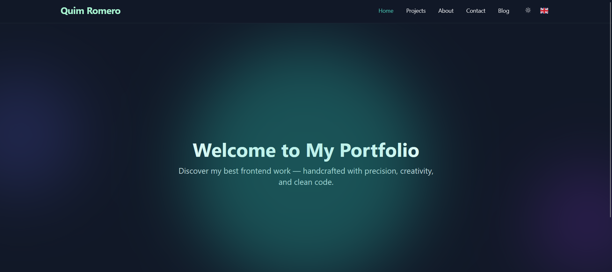
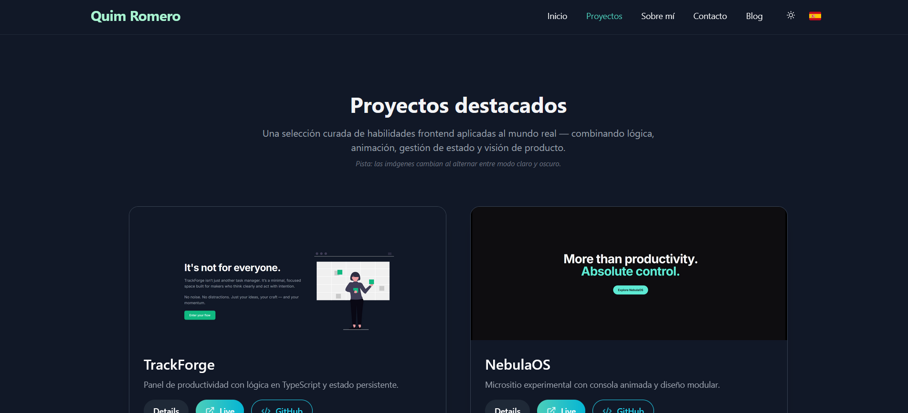
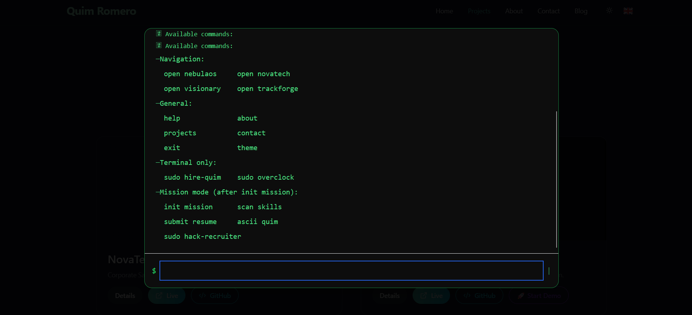

# Quim Romero – Frontend Developer Portfolio

> Interfaces that think. Animations that feel.  
> Real code. Obsessive detail. Product-first mindset.

---

## 🚀 Live Demo

🌐 [https://quimromero.com](https://quimromero.com)

---

## 🧭 About this Project

This is more than a personal website — it's a **real product showcase**.  
A full-stack frontend experience that reflects **how I actually work**.

It includes:
- Custom-built projects that simulate real-world use cases.
- A live terminal interface (`NebulaOS`) for interactive exploration.
- Seamless page transitions, theme switching, internationalization, and more.
- Zero templates, zero page builders — just thoughtful code and purposeful design.

---

## 🧠 Tech Stack

| Technology | Purpose |
|------------|---------|
| **React + TypeScript** | Component architecture and logic |
| **Tailwind CSS** | Scalable atomic styling |
| **Framer Motion** | Smooth, intuitive animations |
| **Zustand** | Lightweight state management |
| **i18n** | Full bilingual support (EN/ES) |
| **EmailJS** | Serverless form submission |
| **Vite** | Super fast dev environment |
| **Cypress** | End-to-end testing |
| **GitHub Actions** | Continuous Integration pipeline |

---

## 📦 Project Structure

- `src/`
  - `components/` – reusable, typed UI elements
  - `features/` – scoped areas like Projects, About, Contact
  - `hooks/` – custom behavior (theme, i18n, etc.)
  - `context/` – global state control
  - `data/` – structured multilingual content
  - `styles/` – resets, font settings, design tokens
- `cypress/` – end-to-end tests for navigation and UI flows
- `public/` – icons, manifest, PWA config

---

## 🧪 End-to-End Testing

This portfolio includes local end-to-end tests powered by Cypress.  
Core flows like navigation, UI preferences, and contact form validation are covered and verified.

Currently tested:

   ✅ Home page: loader removal & headline rendering  
   ✅ Theme & language toggling  
   ✅ Projects page navigation and content check  
   ✅ Contact form rendering, validation, and successful submission  

> 🧰 Tests run locally via `npx cypress open` or `npx cypress run`. 

> **Note:** CI integration (e.g., GitHub Actions) and additional test coverage are planned and will be added in the future.

---

## 📸 Screenshots

| Home | Projects | Terminal |
|------|----------|----------|
|  |  |  |

---

## 📬 Get in Touch

If you’re looking for a frontend engineer who combines **speed, structure, and UX precision**,  
I’m open to freelance work and collaboration with product-driven teams.

📧 quim@quimromero.com  
🌐 [https://quimromero.com](https://www.quimromero.com)

---

## 💡 Notes

- 100% custom-coded — no UI kits, no no-code tools.
- Animations are tailor-made for each section.
- Built with the same mindset I bring to production teams.

---

> _This is how I approach frontend:  
> think like a designer, build like a developer, and deliver like it’s going live tomorrow._
